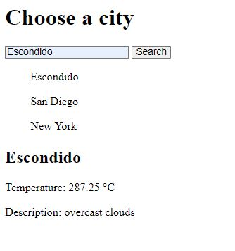

# Weather-Dashboard
This is a very basic weather dashboard. You can get the Temps and Description of the weather.

## General Information
- When you search the temps and conditions of the city are displayed
- On refresh you will be presented with your previous search history.

## Features
- Searching a city will give you a Temperature and description of the weather in the city.

## Screenshots / Links

Links to my deployed page! 
https://tristanm225.github.io/Weather-Dashboard/

## Setup
N/A

## Usage
To see a Temperature and Description of the city.

## Project Status
Project is: _in progress_ 
This project is not done it requires love in both the JS and CSS files.

## Room for Improvement
Include areas you believe need improvement / could be improved. Also add TODOs for future development.

Room for improvement:
- Styling
- Cleaning up text / removing unneccessary code

To do:
- Add 5 day and three hour forcast
- Add CSS to all elements

## Credit / Acknowledgements 
Took ideas from UCSD coding boot camp folder especially the the week 6 mini project

Every possible full stack blog about weather API and local storage

## Contact
Created by TristanM225 Reachout to me by email! TristanM225@gmail.com